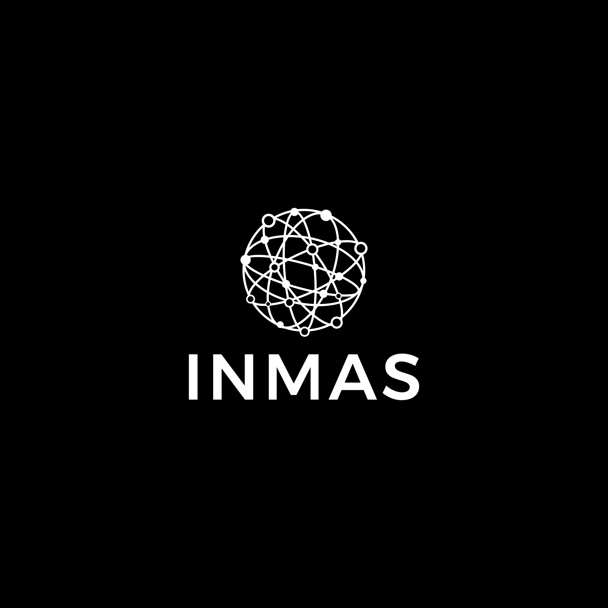

{width=140x align=right}

# Lessons learned from the INMAS program

# A short guide for institutions

## Introduction
This document summarizes the lessons learned during the existence of the INMAS program.

## Node Outreach and Selection
Successfully selecting the participating departments requires a minimum of elements
1)	Existence of a local champion who will help promote the program internally,
1)	Geographical considerations allowing for easy and economical transportation of participating students to
 the hub where the in-person technical training will take place,
1)	Ideally, the participation of more than a single student,
1)	Financial support for the activities.

## Program Coordination
The program is scheduled over the course of two semesters, with training sessions that start in October
and end in March. Training sessions are typically run outside normal school hours to minimize the
interference with regular activities such as classes and TA/RA duties. Professional training sessions
are typically between one and two hours are run remotely in the evenings. Technical training sessions
are delivered as workshops which run over the weekend, starting at dinner time on Friday night
and ending at mid-day on Sunday.

A calendar of activities is decided before the program is advertised. This is done so that students applying to
the program can evaluate their availability to participate in the program.

| Date | Activity| Description |
| ---- | ----     | ---- |
| September | Recruiting | Send email to nodes, information sessions |
| end of September | Application Deadline | Last day to apply to program |
| mid-October | Welcome session | Present program activities and rules for participating (remote)|
| late October | Technical workshop #1 | Fundamentals of Python programming (in-person)|
| early November | Professional training A | Session on resume preparation (remote)|
| mid November | Dealine to provide draft of resume | Last day to submit draft of resume |
| all November | Mentoring | One-on-one meetings to provide feedback on resume and career goals (remote) |
| late November | Technical workshop #2 | Statistical Methods (in-person)|
| early December | Deadline for final resume | Deadline to submit final resume |
| mid-January | Technical workshop #3 | Machine learning (in-person)|
| early February | Professional training B | Inverview preparation (remote)|
| late February | Professioanl training C | Networking |
| late February | Technical workshop #4 | Projects and team work (in-person)|
| March | Professional training D | Internship guidelines (remote)|
| mid-May | Interships start | Typical starting date of internships |
| late August | Internships end | Typical end date of internships |
| September | Due date for internship reports | Summary of internship work |

## Program Advertisement
The advertisement of the program is made through the following instruments:

1) A website describing the program, its goals, activities, and calendar of events,
1) Emails sent to the students enrolled at the participating departments describing the program
 and how to apply,
1) Informational sessions held over Zoom, inclusing time for Q&A. It is good for these sessions to invite
 students who participated in the program in previous years so that they can share
 their experience with prospective students,
1) Optional organized on-site visits to the node presenting the program to the students and answering
 their questions. As for previous point, former students are good ambassadors for the program, and should be
 invited to participate.

## Application Process
This describes how we use Monday.com for the application process.

## Participant Selection Process
This section describes the criteria used for selecting the participating students.

## Professional Training
This describes the modules part of the professional training.
### Resumes
### Networking
### Interviews
### Code of conduct

## Resume Preparation
This section provides tips to help students have more impactful resumes.

## Mentoring
This part gives recommendations on how to provide feedback during one-on-one sessions.

## Technical Training
This section describes the 4 workshops that were used during the INMAS technical training.
 
## Internship Generation and Industry Outreach
This captures the approach used to reach out to the industry and generate internships.

## Matchmaking and Resume Coordination
This provides general recommendations on how to match resumes to internships.

## Internship Progress Monitoring Including Final Report

## Program assessment
This part is on how to gather information that can be used to improve the program.

## Fundraising

